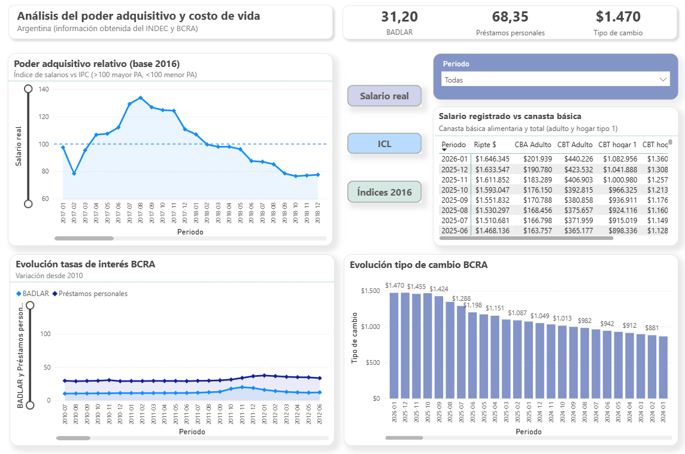
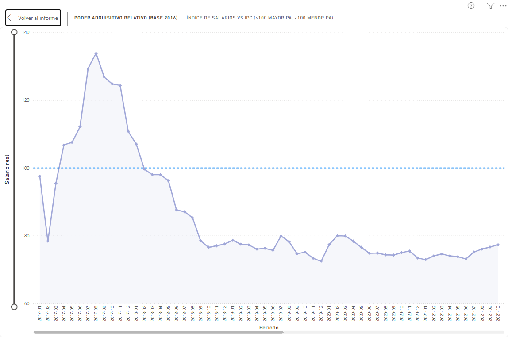
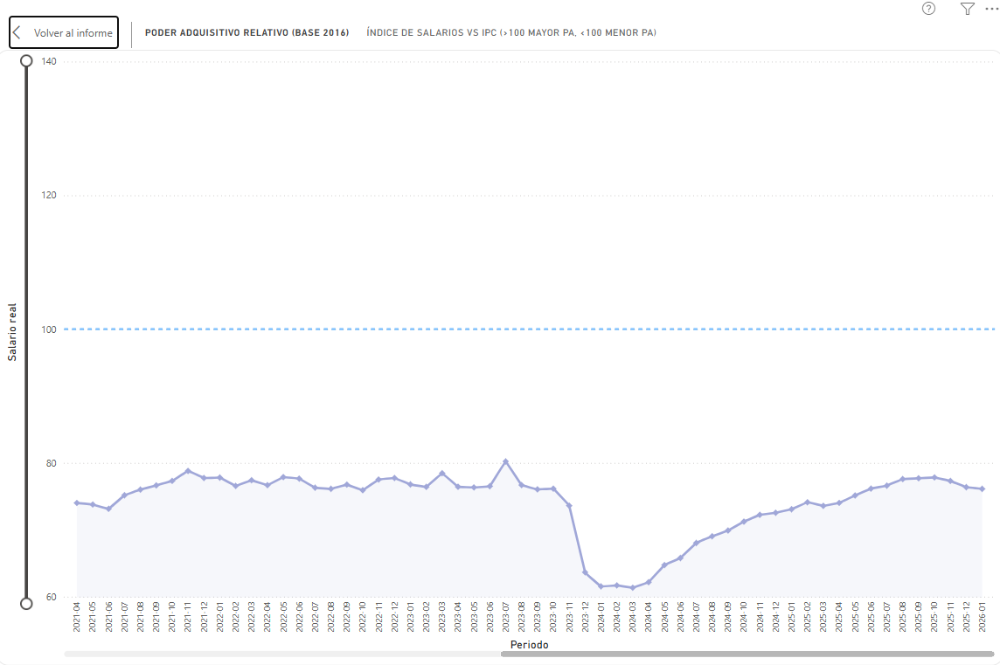
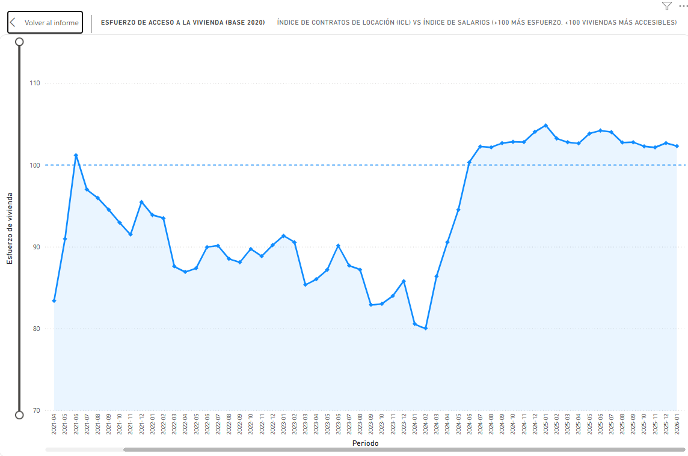
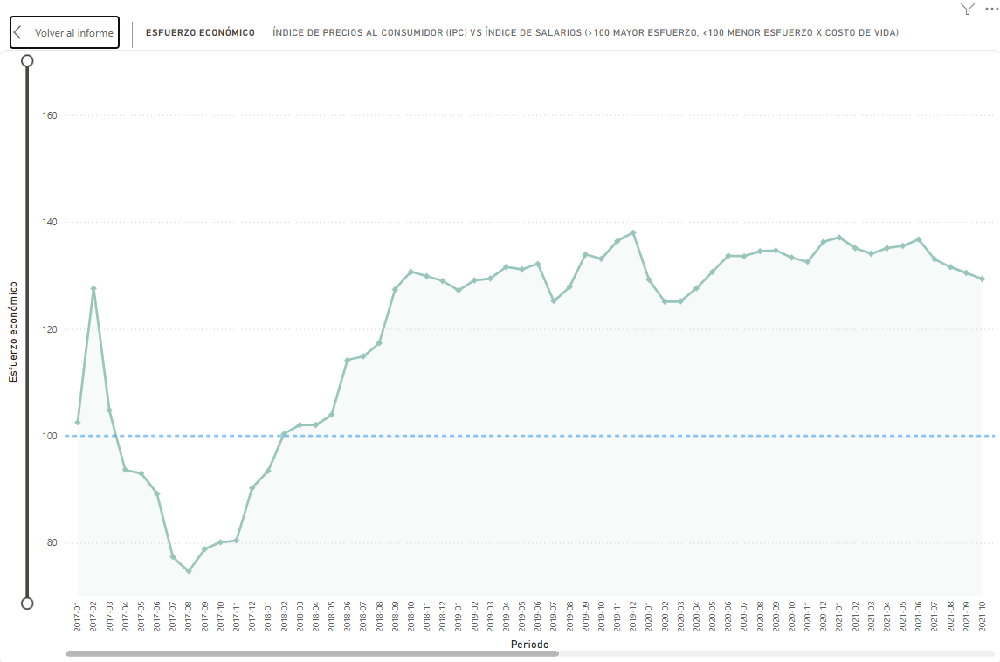
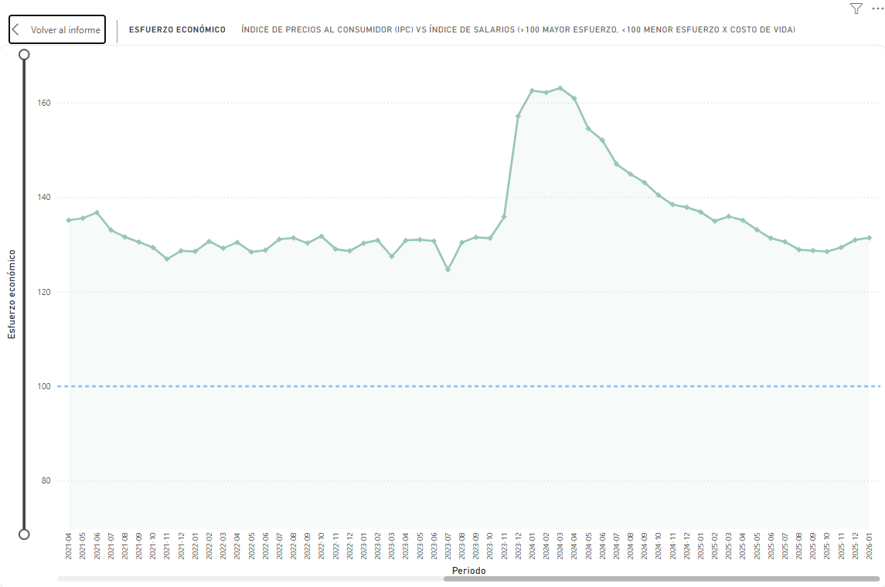
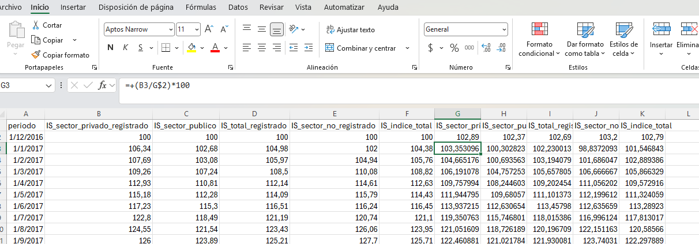
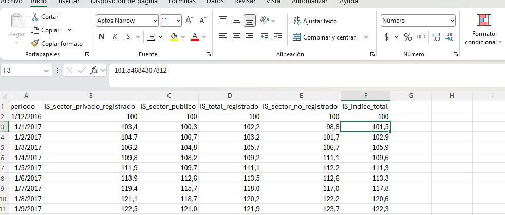
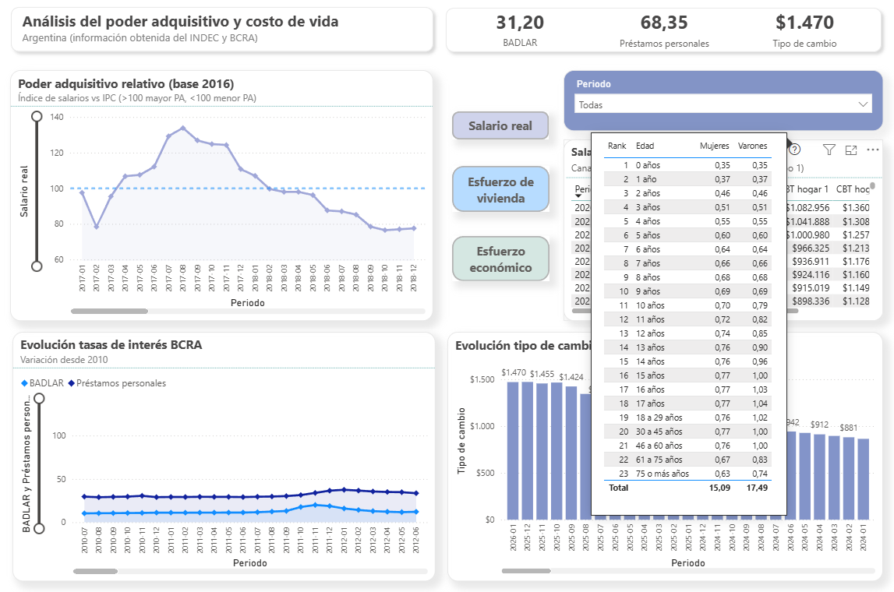
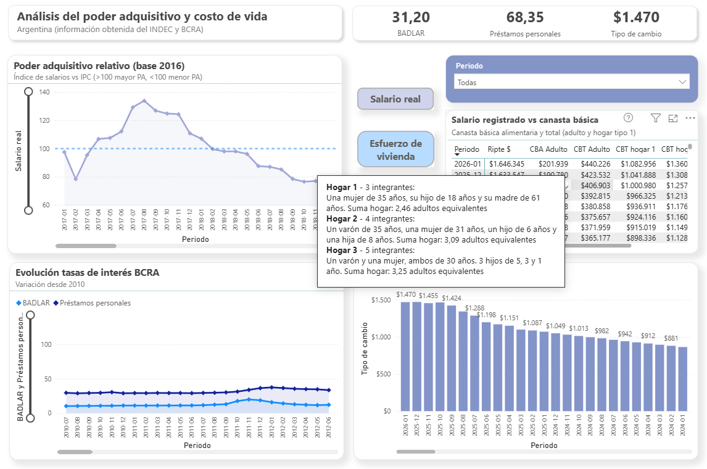

# Purchasing power evolution in Argentina (2026)
Socioeconomic analysis of Argentina focused on purchasing power, examining how **inflation, wages, housing costs, and interest rates** have shaped and impact on **living conditions** in recent years. The **tools used** for this analysis were **Python, Excel and Power BI**. 

## Project Overview

This project presents a data-driven socioeconomic analysis of Argentina, focused on understanding how cost of living and purchasing power have evolved over time.
The primary objective is to compare the evolution of wages against key cost indicators such as inflation and housing (rental prices), in order to assess changes in economic pressure on households. Special attention is given to housing affordability and overall cost-of-living dynamics.

Additionally, the project explores the role of financial variables such as interest rates and exchange rates, providing context on how macroeconomic conditions may influence consumption and access to credit.
Beyond the analysis itself, this project also highlights the limitations and challenges of working with official public datasets (e.g., INDEC, Central Bank), particularly in terms of consistency, methodology changes, and data availability.

This work is intended as a foundational analysis, designed to support future extensions incorporating additional dimensions such as education, health, and broader social indicators.

## Economic Context & Objective

Argentina has experienced persistent macroeconomic instability over the past decade, characterized by high inflation, currency depreciation, and recurrent adjustments in monetary policy.
Since 2016, different economic frameworks have shaped the evolution of key variables such as wages, prices, and access to housing. These dynamics have had a direct impact on purchasing power and household financial stability.

In this context, understanding how wages evolve relative to the cost of living becomes critical. Rising inflation, increasing rental prices, and volatile financial conditions can significantly affect consumption capacity and overall quality of life.
The objective of this analysis is to quantify these dynamics by comparing wage growth against inflation and housing costs, while incorporating financial indicators such as interest rates and exchange rates to provide additional macroeconomic context.

Rather than focusing on short-term fluctuations, this project aims to identify structural trends that help explain changes in economic pressure on households over time. These dynamics have unfolded under different economic policy approaches over time.

## Content Table

1.	[Project Overview](#project-overview)
2.	[Economic Context & Objective](#economic-context--objective)
3.	[Dashboard Preview](#dashboard-preview)
4.	[Key Insights](#key-insights)
5.	[Data Sources](#data-sources)
6.	[Data Preparation](#data-preparation)
7.	[Challenges & Limitations](#limitations--assumptions)
8.	[Conclusions](#conclusions)
9.	[Terminology & Dashboard Use](#terminology--dashboard-use)

## Dashboard Preview

The following dashboard provides an interactive view of the main indicators analyzed in this project.
It is composed of four main visual components (one of which includes interactive buttons on the side):

- A line chart displaying the evolution of purchasing power over time, along with housing burden and overall cost-of-living burden.
- A comparative table showing RIPTE (registered wages) against the basic food basket and different household basket levels.
- A second line chart illustrating the evolution of key interest rates (BADLAR and personal loans).
- A bar chart, ordered by descending year, representing the evolution of the exchange rate.

Additionally, the dashboard includes smaller supporting elements such as KPI cards in the top-right corner (highlighting current BADLAR, personal loan rates, and exchange rate values), as well as a period filter to dynamically explore the data.

## Key Insights

### Sustained decline in purchasing power

Purchasing power reached its last significant peak between mid-2017 and early 2018. Since then, real wages have shown a sustained downward trend relative to inflation.

A particularly sharp drop occurred around late 2023, followed by a partial recovery in 2024–2025. However, current levels remain significantly below the 2017 peak, indicating a structural deterioration in real income.

---

### Increasing housing burden since 2024

Until early 2024, housing affordability fluctuated around relatively stable levels, suggesting that wages were, in many cases, still aligned with rental costs.

However, since March 2024, the housing burden index has increased sharply and consistently, indicating that rental prices have grown faster than wages. This marks a clear deterioration in access to housing.

---

### Cost of living consistently outpacing wages

Since 2018, the cost of living (proxied by inflation) has systematically exceeded wage growth.

This is reflected in the living cost burden index remaining above baseline levels, confirming a persistent loss of purchasing power over time.

---

### High interest rates and reduced access to credit

Interest rates on personal loans increased significantly in recent years, peaking around 2023 and partially stabilizing in 2024.

Despite this stabilization, current levels remain elevated compared to the 2010–2018 period, suggesting tighter financial conditions and reduced access to credit for households.

---

### Long-term currency depreciation

The exchange rate remained relatively stable until 2018, after which it experienced a sharp and sustained increase.

This long-term depreciation reflects broader macroeconomic instability and contributes to inflationary pressures, further impacting real income.

---

### Limitations of income indicators (RIPTE)

While RIPTE provides a useful reference for registered wages, it may overestimate average income levels, as it excludes informal workers and may be influenced by higher-income segments.

As a result, real household conditions—especially for lower-income groups—may be more constrained than the data suggests.

---

### Gap between theoretical baskets and real living costs

Although basic consumption baskets define poverty and indigence thresholds, they represent minimum subsistence levels rather than realistic living standards.

Actual expenses such as clothing, healthcare, and housing often exceed these thresholds, highlighting a gap between statistical measures and lived economic conditions.

Overall, the analysis suggests a growing disconnect between official economic indicators and the actual cost of living experienced by households.

## Data Sources

The datasets were obtained from official government websites such as INDEC and BCRA (Central Bank):

- [Salary index - INDEC](https://www.indec.gob.ar/indec/web/Nivel4-Tema-4-31-61)
- [Inflation rates (IPC) - INDEC](https://www.indec.gob.ar/indec/web/Nivel4-Tema-3-5-31)
- [Food basket - INDEC](https://www.indec.gob.ar/indec/web/Nivel3-Tema-4-43)
- [RIPTE - Argentina.gob.ar](https://www.argentina.gob.ar/trabajo/seguridadsocial/ripte)
- [Exchange rates - BCRA](https://www.bcra.gob.ar/principales-variables-datos/?serie=7927)
- [Interest rates - BCRA](https://www.bcra.gob.ar/principales-variables-datos/?serie=7925&serie1=0&serie2=0&serie3=0&serie4=0)
- [Housing (ICL) - BCRA](https://www.bcra.gob.ar/principales-variables-datos/?serie=7988)

## Data Preparation

Data preparation combined automated processing using Python with manual adjustments in Excel, due to structural inconsistencies across official datasets.

### RIPTE (Wages) – PDF Extraction & Normalization

The RIPTE dataset was originally published in PDF format, requiring extraction before analysis.

- Tables were extracted using Python (Camelot).
- Due to inconsistencies in structure (misaligned columns, multi-row headers), additional manual normalization was performed in Excel.
- This included removing unnecessary columns, restructuring headers, and aligning data into a tabular format.
- Encoding issues (Latin-1) were resolved by converting files to UTF-8.

📁 See script: [`/scripts/01_pdf_to_csv_ripte.py`](https://github.com/lucasmerlino33/Purchasing-power-evolution-in-Argentina/blob/main/scripts/01_pdf_to_csv_ripte.py)

---

### Housing Index (ICL) – Frequency Transformation

The ICL dataset was originally provided at a daily frequency.

- Data was transformed to a monthly frequency using Python.
- The last available value of each month was selected as representative.
- Date formats were standardized.
- July 2020 was explicitly enforced as the base period (index = 100) to ensure consistency.

📁 See script: [`/scripts/02_converting_icl_month.py`](https://github.com/lucasmerlino33/Purchasing-power-evolution-in-Argentina/blob/main/scripts/02_converting_icl_month.py)

---

### Index Rebasing (Normalization Across Datasets)

To ensure comparability across variables, all indices were rebased to a common reference period.

- Salary Index and CPI were aligned using December 2016 as base (100).
- Housing Index (ICL), originally based on July 2020, required an additional rebasing step, in which new files were created (for salary index and inflation index with a new base on 2020) in order to made them comparable to each other.
- The standard rebasing formula applied was:

Rebased Index = Original Index / Index at Base Period * 100

This process ensured that all indicators could be directly compared in relative terms.

---

---

### Additional Data Sources

Other datasets (interest rates, exchange rates, basic consumption baskets, and adult equivalence rates) required minimal preprocessing.

- Data was imported and standardized in Excel.
- Formatting adjustments were applied where necessary (dates, numeric formats).
- No major structural transformations were required due to relatively clean source formats.

📁 See data directory: [`/data`](https://github.com/lucasmerlino33/Purchasing-power-evolution-in-Argentina/tree/main/data)

---

### Notes on Data Quality

Working with official public datasets (INDEC, BCRA) presented several challenges:

- Lack of standardization across time
- Changes in base periods
- Inconsistent file formats (PDF, Excel, CSV)
- Structural differences between datasets

As a result, part of the preparation process involved ensuring methodological consistency before analysis. All transformations were designed to prioritize interpretability and comparability over complexity.

## Limitations & Assumptions

### Data availability and methodological changes

One of the main limitations of this analysis is the lack of consistent historical data across all variables.

- Several key indicators (e.g., Salary Index, ICL) are only available from recent years (2016 onwards, in the case of ICL from 2020 onwards).
- Methodological changes introduced around 2016 limit comparability with earlier periods.
- Although CPI (inflation) data exists for prior years, differences in formats and methodologies make long-term comparisons unreliable.

For this reason, the analysis focuses on the period where data is more consistent and comparable.

---

### Lack of absolute price data

The analysis relies heavily on index-based measures rather than absolute values.

- Housing costs are represented through the ICL index, without access to actual rental price levels.
- There is no unified dataset combining wages, rent, utilities, and consumption into a single household budget.

As a result, the analysis captures relative trends rather than exact affordability in monetary terms.

---

### Income measurement limitations (RIPTE)

RIPTE is the only available official source for absolute wage levels, but it has important limitations:

- It includes only registered private sector workers.
- It excludes informal employment, which represents a significant portion of the labor market.
- It may be biased upward due to higher-income segments within the registered workforce.

Therefore, actual income conditions, especially for lower-income and informal workers, may be more constrained than reflected in the data.

---

### Consumption basket limitations

Basic consumption baskets (CBA and CBT) represent minimum subsistence thresholds rather than realistic living standards.

- Certain categories such as clothing, healthcare, and housing may be underestimated.
- Private expenses (e.g., private healthcare, education, insurance) are not fully captured.
- Discretionary spending (leisure, entertainment, dining) is excluded.

This creates a gap between statistical thresholds and real household expenses.

---

### Financial access and housing ownership

This analysis focuses on rental dynamics and does not include housing ownership.

- Access to homeownership has become increasingly limited due to:
  - lack of mortgage credit
  - high inflation and currency volatility
  - limited long-term savings capacity

As a result, the analysis reflects housing access primarily through rental affordability, not property acquisition. These limitations suggest that real living conditions may be more constrained than what formal indicators capture.

---

### Assumptions

- Indices are assumed to be representative of general trends, despite underlying heterogeneity across population groups.
- Monthly data is treated as sufficiently granular to capture economic dynamics.
- Financial indicators (interest rates, exchange rates) are used as contextual variables rather than direct causal drivers.

## Conclusions

This analysis highlights a persistent structural issue in Argentina’s economy: the sustained deterioration of purchasing power over time.

Despite different economic policy approaches across recent years, the data consistently shows that wages have struggled to keep pace with inflation and rising living costs. This dynamic is reflected not only in declining real wages, but also in increasing economic and housing burdens.

Beyond the numbers, these trends help explain broader social patterns. Economic pressure is not evenly distributed, but it is widely felt. The difficulty in maintaining stable income, accessing housing, and covering basic expenses contributes to a sense of uncertainty that affects long-term decision-making.

This context may help explain phenomena such as increased financial stress, delayed independence among younger generations, and the growing intention to seek opportunities abroad. In this sense, the data reflects not only economic variables, but also underlying social dynamics.

There is also a notable gap between official indicators and perceived living conditions. While statistical thresholds define minimum consumption levels, they do not fully capture the complexity of real expenses or quality of life.

Ultimately, this project suggests that economic stability cannot be assessed solely through isolated indicators. A broader perspective: integrating income, cost of living, housing access, and financial conditions, is necessary to better understand the challenges faced by households.

This work serves as a starting point for further analysis, with the aim of incorporating additional dimensions such as education, healthcare, and consumption patterns to build a more comprehensive view of living conditions in Argentina.

## Terminology & Dashboard Use

The main dashboard is presented in Spanish, as the primary audience of this analysis is local. This glossary is intended to facilitate interpretation for non-Spanish-speaking readers. Below is a reference guide for key terms used throughout the project:

| English Term | Spanish Term | Description |
|-------------|-------------|------------|
| Purchasing Power | Poder Adquisitivo (PA) | Real income adjusted by inflation |
| Inflation | IPC (Índice de Precios al Consumidor) | Consumer price index |
| Housing Cost | ICL (Índice de Contratos de Locación) | Rental price index |
| Housing Burden | Esfuerzo de vivienda | Relative cost of housing vs wages |
| Living Cost Burden | Esfuerzo económico | Relative cost of living vs wages |
| Living Cost | Costo de vida | General price level (proxied by IPC) |
| Salary Index | Índice de salarios | Wage index (INDEC) |
| Wages (RIPTE) | RIPTE | Registered private sector wages (may overestimate average income) |
| Basic Food Basket | Canasta Básica Alimentaria (CBA) | Minimum food consumption (indigence line) |
| Total Basic Basket | Canasta Básica Total (CBT) | Poverty threshold |
| Household Basket | Canasta básica hogar | Estimated cost for a representative household |
| Interest Rates | Tasas de interés (BCRA) | Monetary and financial rates |
| Exchange Rate | Tipo de cambio | ARS/USD reference rate |
| Personal Loans | Préstamos personales | Consumer credit rates |
| BADLAR | BADLAR | Interest rate for large deposits (banking system reference) |

Basic instructions for extra information:

Place the cursor over "?" bottom to read the equivalent adult rate used for the household basket

Place the cursor over the dashboard to read the description for each household basket

